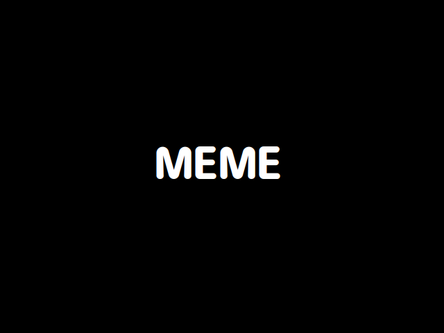
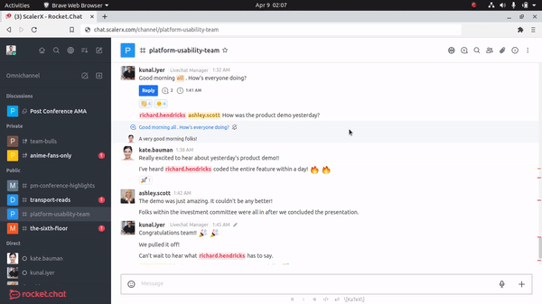
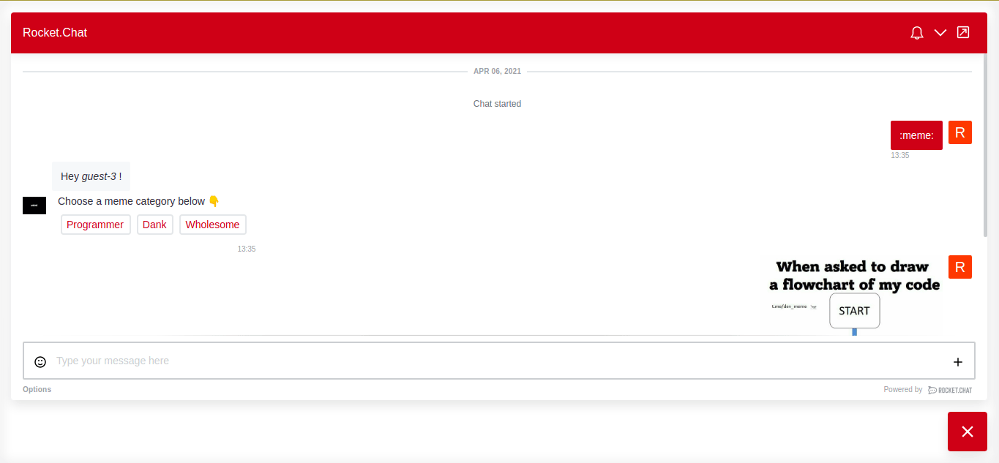

# MemeBuddy

Cheer up! MemeBuddy's here. 🎉

MemeBuddy is your new wingman to get memes on Rocket.Chat. A `/meme` is all it needs to fetch you a new meme everytime!



## 📺 Demo 

### Team Channel

MemeBuddy works on Rocket.Chat team channels through the `/meme` slash command.



### Omnichannel

To get MemeBuddy to work on Rocket.Chat omnichannel just send a `:meme:` within the LiveChat client.



## 🤝 Contributing

You'll need to set up the Rocket.Chat Apps dev environment, please see https://developer.rocket.chat/apps-development/rocket.chat-app

To install the using the command line, you have to turn on the setting Enable development mode on the Rocket.Chat server under `Admin > General > Apps`.

Then you can clone this repo and then:

```
npm install
rc-apps deploy
```

Follow the instructions and when you're done, the app will be installed on your Rocket.Chat server.

Accepting feature requests and bugs on the [issues page](https://github.com/RonLek/Rocket.Chat.App-Meme-Me-Up-Scotty/issues).

A big shoutout to [@D3vd](https://github.com/D3vd) for their [meme api](https://github.com/D3vd/Meme_Api).

## ❤️ Show your support

Please ⭐️ this repository if this project helped you!
